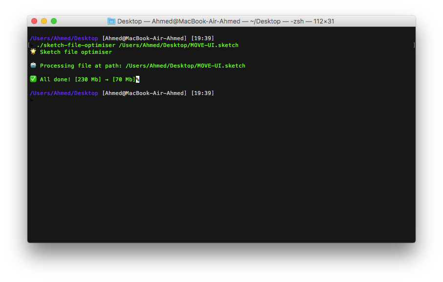
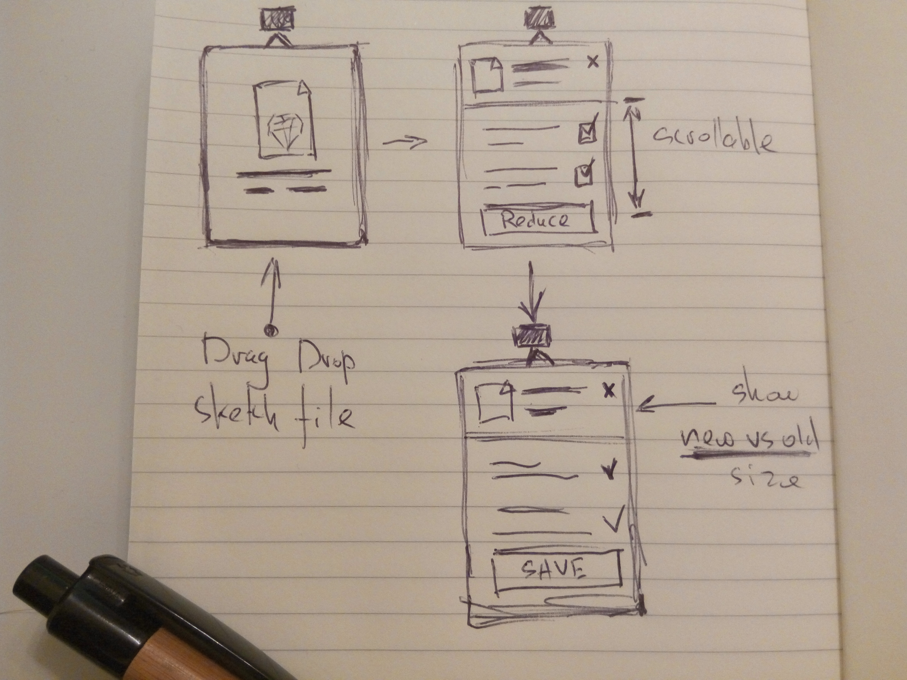

**Sketch had brought** totally new standards for file sizes. You no longer see 10 GB Photoshop files all over the place. Nevertheless, huge Sketch files exist, and they slow down Sketch. As a result, your productivity slows down as well.

Let’s be honest: It's not the design files that become bigger by magic. It’s designers who fill their files with unused, unoptimized and hidden elements that take unnecessary space.

We have faced this problem in our startup, Flawless App. We tend to have a separate Sketch file for each product. By “product”, I mean our core menu-bar application, website, social materials, press kit, illustrations for the articles on our Medium blog, and so on. These files used to grow a lot over time because of constant iterations and testing of different design decisions. As a result, it became harder and harder for Sketch to manage them with proper performance.

As any other engineers would do, we decided to write a small script that cleans and optimizes Sketch files automatically.

<figure>
    
    <figcaption class="caption">The very first version as a script in Terminal.</figcaption>
</figure>

Scripts are great — that is, if you speak the same language as Terminal. 
Eventually, we decided that we needed a more human-like approach to allow more people from the team to use it. 
We also wanted to make it free and publicly available later on.

## The First Prototype

1. We already had an internal framework for menu bar applications, with a lot of custom functions implemented. To give you some background: our core product, Flawless App, is a menu bar application that compares the expected design with the developer's implementation in real time. This internal framework was built for our core product.
2. You can use the menu bar application even when Sketch isn’t open.
3. Developing a native macOS app was much faster for us than a Sketch plugin with CocoaScript (because of our previous experience).


* We already had an internal framework for menu bar applications, with a lot of custom functions implemented. To give you some background: our core product, Flawless App, is a menu bar application that compares the expected design with the developer's implementation in real time. This internal framework was built for our core product.
* You can use the menu bar application even when Sketch isn’t open.
* Developing a native macOS app was much faster for us than a Sketch plugin with CocoaScript (because of our previous experience).


It was also crucial to give the user the ability to toggle different optimization options for different files.

Here is the very first wireframe, drawn on an old-fashioned paper, no fancy prototyping tools.

<figure>
    
    <figcaption>Initial Reduce app wireframe.</figcaption>
</figure>

## Links

There are two ways to create links.

[I'm an inline-style link](https://www.google.com)

[I'm a reference-style link][Arbitrary case-insensitive reference text]

[You can use numbers for reference-style link definitions][1]

Or leave it empty and use the [link text itself]

URLs and URLs in angle brackets will automatically get turned into links.
http://www.example.com or <http://www.example.com> and sometimes
example.com (but not on Github, for example).

Some text to show that the reference links can follow later.

[arbitrary case-insensitive reference text]: https://www.mozilla.org
[1]: http://slashdot.org
[link text itself]: http://www.reddit.com

## Code and Syntax Highlighting

```javascript
var s = "JavaScript syntax highlighting";
alert(s);
```

```python
s = "Python syntax highlighting"
print s
```

```
No language indicated, so no syntax highlighting in Markdown Here (varies on Github).
But let's throw in a <b>tag</b>.
```

## Tables

Tables aren't part of the core Markdown spec, but they are part of GFM and *Markdown Here* supports them. They are an easy way of adding tables to your email -- a task that would otherwise require copy-pasting from another application.

Colons can be used to align columns.

<div class="breakout">

| Tables        | Are           | Cool |
| ------------- |:-------------:| -----:|
| col 3 is      | right-aligned | $1600 |
| col 2 is      | centered      |   $12 |
| zebra stripes | are neat      |    $1 |

</div>

The outer pipes (|) are optional, and you don't need to make the raw Markdown line up prettily. You can also use inline Markdown.

Markdown | Less | Pretty
--- | --- | ---
*Still* | `renders` | **nicely**
1 | 2 | 3

<a name="blockquotes"/>

## Blockquotes

> Blockquotes are very handy in email to emulate reply text.
> This line is part of the same quote.

Quote break.

> This is a very long line that will still be quoted properly when it wraps. Oh boy let's keep writing to make sure this is long enough to actually wrap for everyone. Oh, you can *put* **Markdown** into a blockquote.

<a name="html"/>

## Inline HTML

You can also use raw HTML in your Markdown, and it'll mostly work pretty well.

<dl>
  <dt>Definition list</dt>
  <dd>Is something people use sometimes.</dd>

  <dt>Markdown in HTML</dt>
  <dd>Does *not* work **very** well. Use HTML <em>tags</em>.</dd>
</dl>