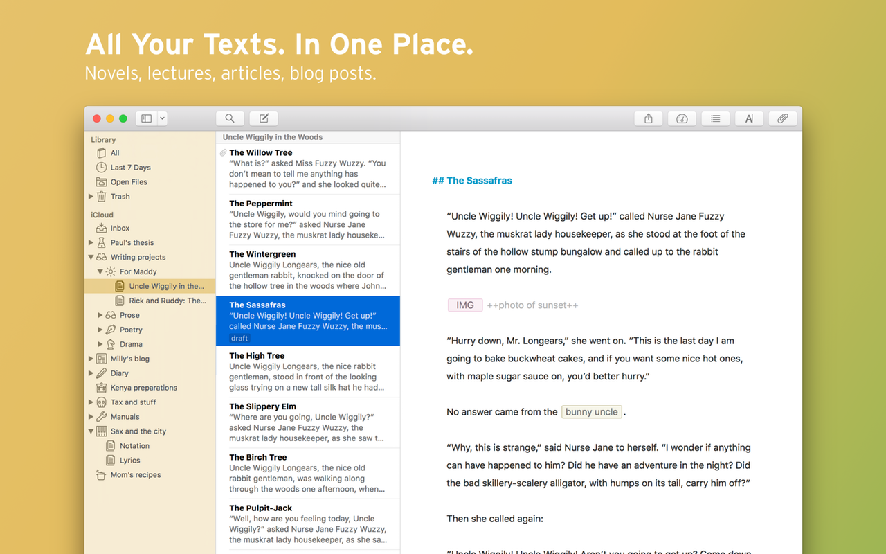
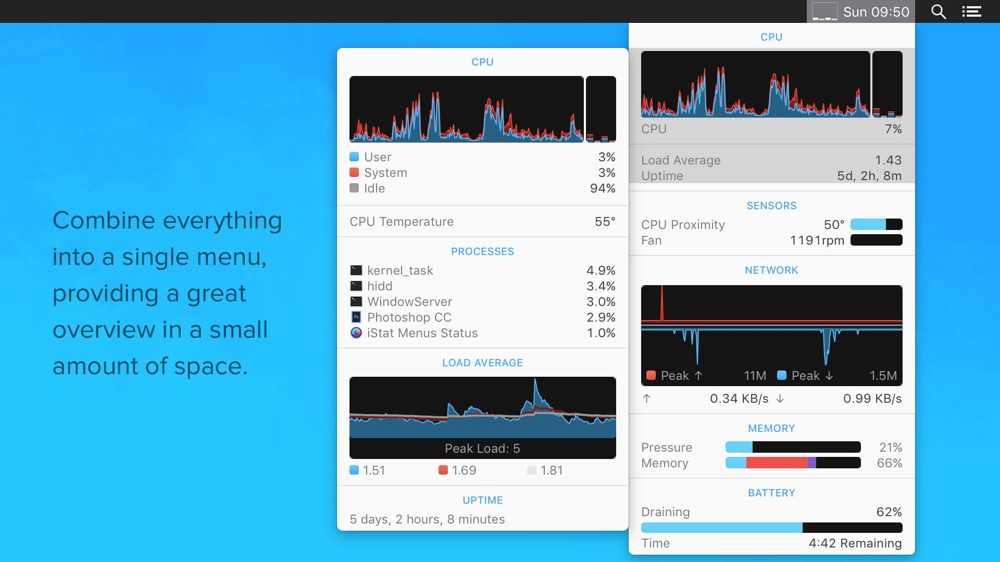
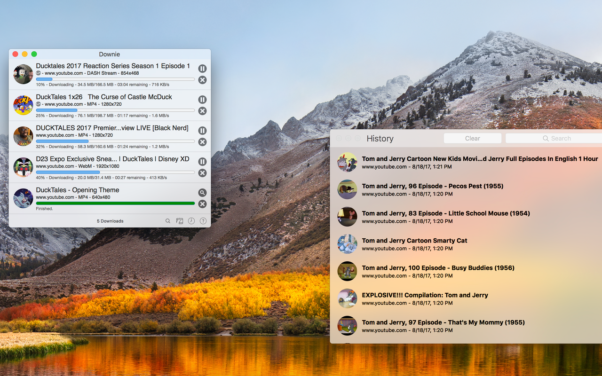
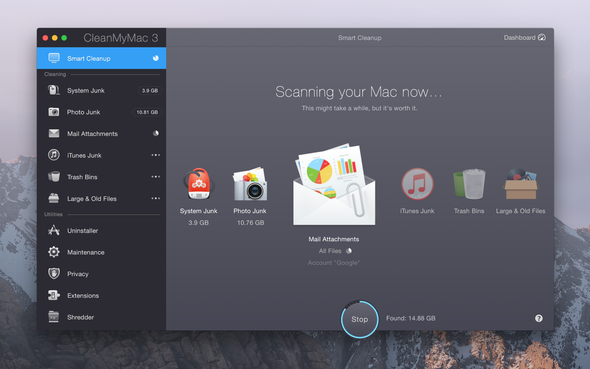
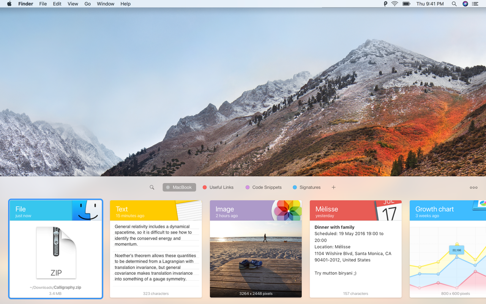
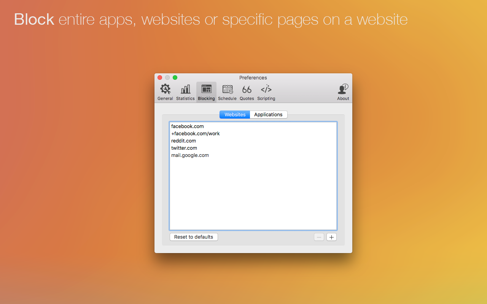
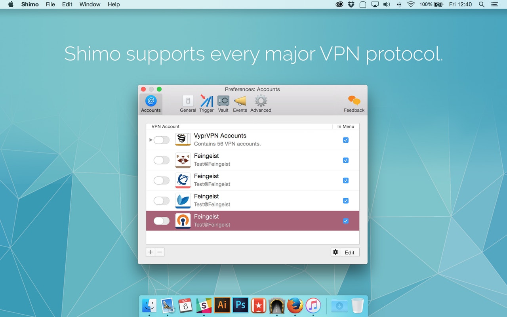
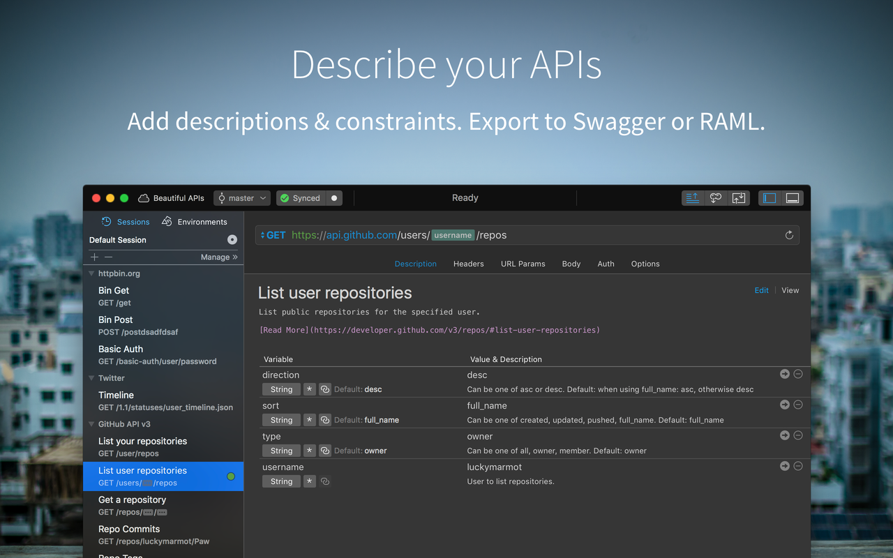
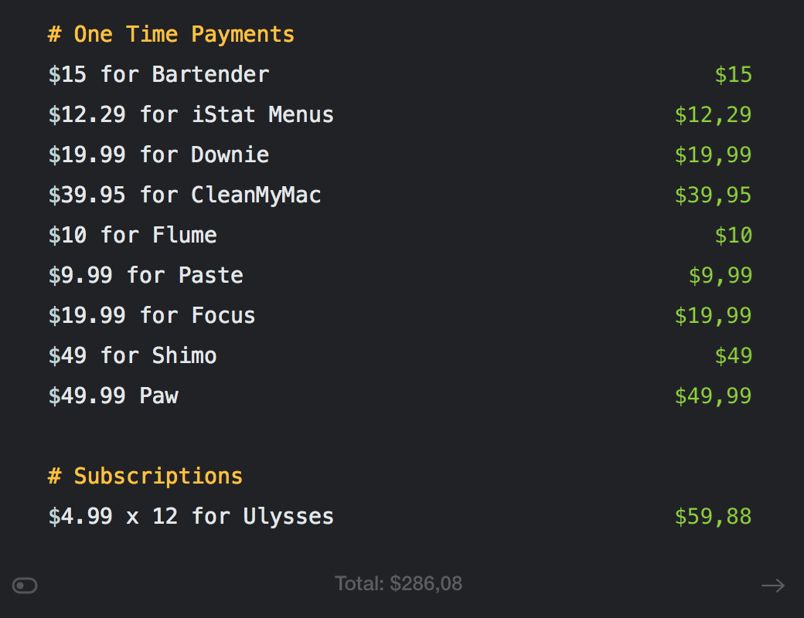

What is [Setapp]? First of all, it's a product I fell in love with from the very first day of using it and I'm really keen to share it with you.

[Setapp] is a subscription service that is making a revolution in apps distribution on macOS. Instead of buying each application separately, you just pay a fixed amount of money each month as a subscription fee and get a huge list of apps available for download and use anytime you want.

<figure>
    
</figure>

At the moment of writing this article they have 107 apps on the platform and the number constantly grows.

## My 10 favourite apps on Setapp

### [Ulysses]

My personal #1 app from all the list is Ulysses. It's a writing app and markdown editor, which allows you to write texts without distractions, provides a convenient way to store and categorize your notes and ability to export your notes into beautiful ebooks, PDFs, DOCX, or even directly to Wordpress or Medium. The app syncs content via iCloud account, so all your writings are available on your other devices.

I keep all my writings there and I have never felt more motivated to write.

### [Bartender]

Bartender is a small utility that should be familiar to almost every Mac user. With Bartender you can choose which apps stay in the menu bar, are displayed in the Bartender Bar or are hidden completely.

### [iStat Menus]

iStat Menus is an advanced system monitor for your menu bar, letting you check the vital stats of your Mac at a glance: realtime CPU graphs, memory consumption, network activity, hard drive temperature and a lot other values.

### [Downie]

Have you ever wanted to download video from Youtube, Video, Facebook or, let's say, Instagram? Downie allows you to do that. It works with thousands websites.

### [CleanMyMac]

CleanMyMac 3 is a powerful app to clean and optimize your Mac. It has a range of tools, including system cleanup, uninstaller to delete apps on Mac and leave nothing behind, shredder to remove files without a trace, and a set of optimization tweaks.

### [Flume]

Flume brings everything you love about Instagram to Mac in a beautiful app. You can view and like photos, comment, follow, share, and most importantly, post to Instagram from Mac.

### [Paste]

This powerful clipboard history manager automatically keeps everything you have copied regardless of its format - text, pictures, screenshots, links, and others. So, you quickly get anything back anytime you need it.

### [Focus]

Focus helps preserve your productivity by blocking whatever sites or apps are sapping your attention. Working together with your browser or macOS, it’s in your corner in the fight against temptation.

### [Shimo]

Shimo is what you will simply adore because this VPN client provides a rich user interface combined with military-level security. When it comes to creating, editing, and controlling VPN connections, this is the genuine leader. Supporting more protocols than any other VPN, this Mac VPN client comes with a bunch of advanced capabilities. Plus, it uses the AES 256-bit encryption, which is certified by official organizations, international companies, and army.

### [Paw]

Being exclusively built for macOS, Paw is a powerful app for developers to debug and test APIs. It provides delightful interaction with REST services. Effortlessly get dynamic values and inline computed components in any field of your request. Plus, you’ll adore the fact that every of its options is designed with a quick mouse or keyboard shortcut access.

## It's it expensive?

Actually, it's not. Let's do a quick calculation.

<figure>
    
</figure>

[Setapp] costs $9.99 + VAT per month, so would spend these $286 only after 2 years of having subscription, but there some other facts that should be considered along with price:

* With Setapp you get free updates of all current apps and get all new apps that arrive each month.
* Most of the "one-time-payment" licenses are limited to be used on one computer. With Setapp you can use all apps on all your Macs without any limitation.
* The first week is for free and you can get free month by inviting friends.
* There is an educational discount, so if you're a student you can get subscription for 50% of original price.

***

Haven't convienced yet? [Try 7-day free trial](https://go.setapp.com/invite/o3c4i1zc). 
It's awesome!

[setapp]: https://go.setapp.com/invite/o3c4i1zc
[bartender]: https://www.macbartender.com/
[ulysses]: https://ulyssesapp.com
[istat menus]: https://bjango.com/mac/istatmenus/
[downie]: https://software.charliemonroe.net/downie.php
[cleanmymac]: https://macpaw.com/cleanmymac
[flume]: https://flumeapp.com/
[paste]: https://pasteapp.me/
[focus]: https://heyfocus.com/
[shimo]: https://www.shimovpn.com/
[paw]: https://paw.cloud/