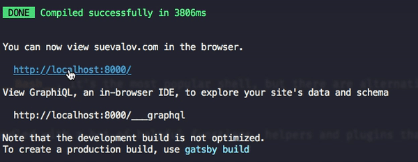
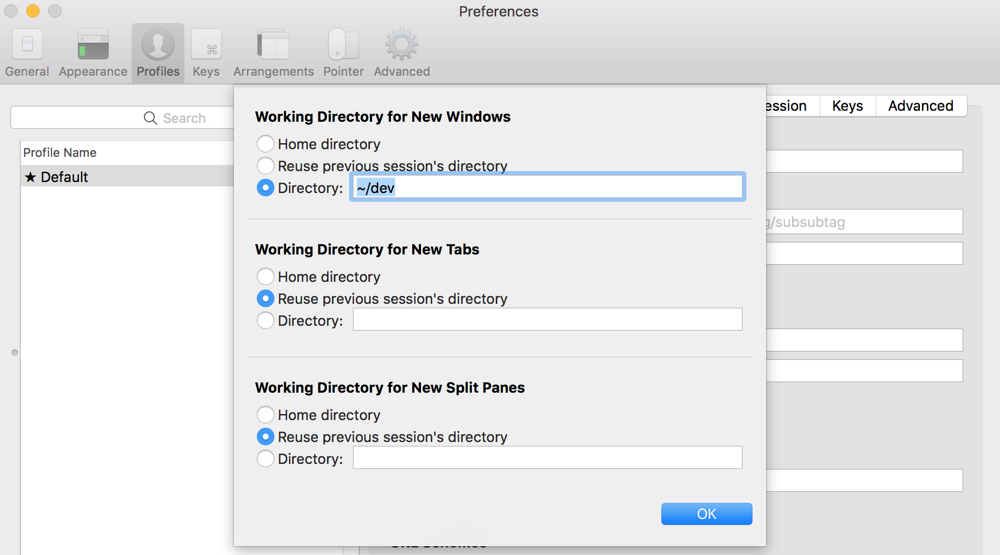
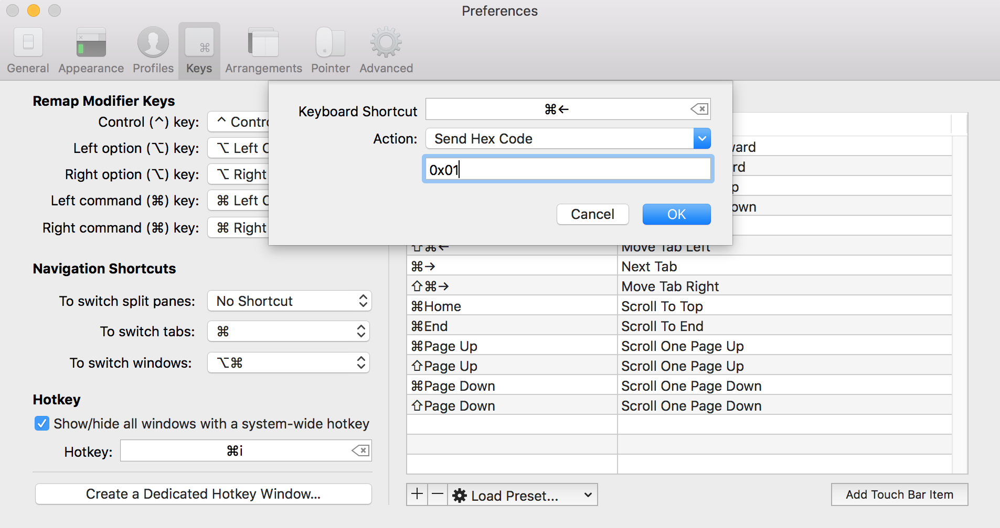
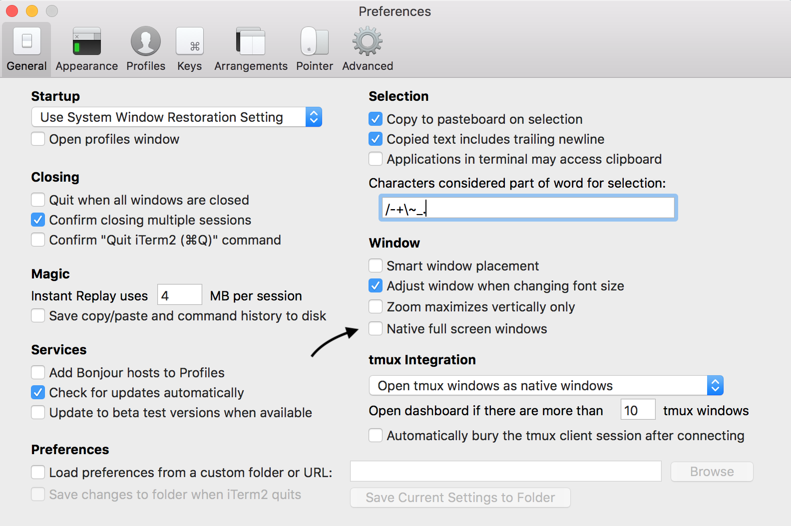
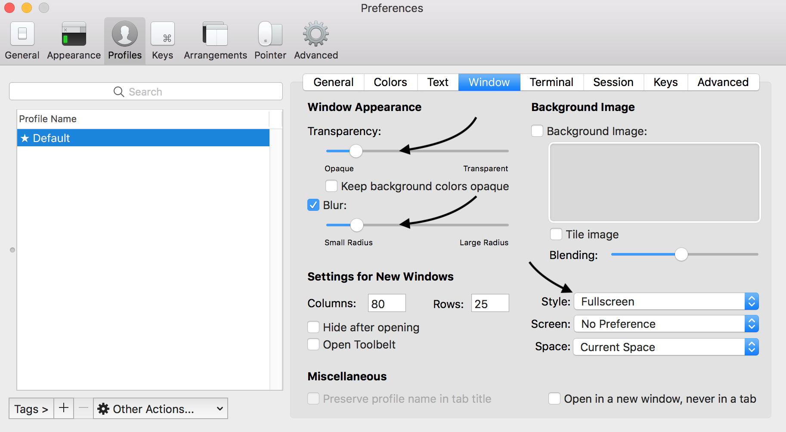
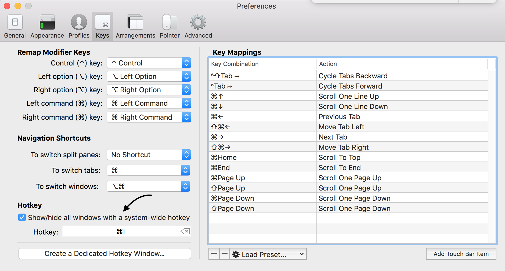

My productivity heavily depends on the tool belt I use. Terminal is not an exception and I'd like to share my configuration and tweaks.

Let's go thought all the steps I would do if I bought the new laptop and I need to configure everything from scratch.

## Use iTerm2

Let's start from replacing default `Terminal.app` by [iTerm2](https://www.iterm2.com/), feature-packed and easily configurable solution that claimed to "do amazing things". Can't disagree with that.

* Download [iTerm2](https://www.iterm2.com/downloads.html)
* Read [the whole list](https://www.iterm2.com/features.html) of its features

## Use ZSH and Oh My ZSH

When you start a terminal application, by default it is running a shell called __Bash__. It's the most popular shell, but there are alternatives that make using the terminal faster and
more comfortable for developers.

My choice is ZSH and ZSH framework - [Oh My ZSH](http://ohmyz.sh/). It comes bundled with a hot of helpful functions, helpers and plugins that boost your productivity.

* Install [Oh My Zsh](https://github.com/robbyrussell/oh-my-zsh)

* Read [Become A Command-Line Power User With Oh My ZSH And Z](https://www.smashingmagazine.com/2015/07/become-command-line-power-user-oh-my-zsh-z/)

## Make Your Terminal Pretty

I tried a lot of ZSH prompt themes and finally stayed with [Pure](https://github.com/sindresorhus/pure).

* Install [Pure](https://github.com/sindresorhus/pure)
* Install [zsh-syntax-highlighting](https://github.com/zsh-users/zsh-syntax-highlighting)
* Import [Snazzy.itermcolors](https://github.com/sindresorhus/iterm2-snazzy) to `Profiles -> Colors` in iTerm2 Settings

## Learn iTerm2 Tips & Tricks

### Useful Hotkeys

| Keys                 | Purpose                       |
| -------------------- | ----------------------------: |
| `Cmd + Shift + H`    | Show paste history            |
| `Cmd + /`            | Find current input            |
| `Cmd + D`            | Split pane horizontally       |
| `Cmd + Shift + D`    | Split pane vertically         |
| `Cmd + ]`            | Next pane                     |
| `Cmd + [`            | Previous pane                 |
| `Cmd + +`            | Increase font size            |
| `Cmd + -`            | Decrease font size            |
| `Cmd + T`            | Open new tab                  |
| `Cmd + Number`       | Switch to window              |
| `Cmd + K`            | Clear buffer                  |

### Open links from terminal

<figure style="text-aling: center;">
    
    <figcaption>Hover while <code class="language-text">Cmd</code> is pressed</figcaption>
</figure>

Hold `Cmd` key while clicking on the link in the terminal. It's really useful when the output of the command is referring to some external resource.

### Different working directories

By default, splitting current screen in iTerm2 gives me new split screen in default location (which is user’s home directory) not in my current location. If you want to have split screen of the current location you are working in go to `Profiles → Working Directory -> Advanced Configuration`.

<figure>
    
</figure>

### Map keys to jump between words

If you have experienced typing very long command and you want to fix a typo in the middle, there are not that many choices but to keep pressing left arrow key until the cursor reaches where typo happens.

You can jump between words by sending some special characters in shell and iTerm2 can make it easier. You can go to: `Keys → Key Mappings` and add key mappings you want.

<figure>
    
</figure>

| Keys          |    Action              |  Value |                       Purpose |
| ------------- | :--------------------: | -----: | ----------------------------: |
| Cmd ←         |  “Send Hex Code”       | `0x01` | Jump to beginning of the line |
| Cmd ➝         |  “Send Hex Code”       | `0x05` |       Jump to end of the line |
| Cmd Backspace |  “Send Hex Code”       | `0x15` |           Delete current line |
| Alt ←         | “Send Escape Sequence” |    `b` | Jump to beginning of the word |
| Alt ➝         | “Send Escape Sequence” |    `f` |       Jump to end of the word |
| Alt Backspace |  “Send Hex Code”       | `0x17` |                   Delete word |

### Non-native fullscreen mode

It's quite controversial step, but it works perfectly for me.

iTerm offers the option to disable “native full screen mode.” This makes it easy to switch back-and-forth between an editor and shell. How? Rather than opening a native full-screen app with the accompanying slow animation, iTerm instantly places a terminal over the desktop.

<figure>
    
</figure>

<figure>
    
</figure>

<figure>
    
</figure>

## Add Plugins and Aliases

* itermocil
* thefuck
* z
* add plugins for zsh
