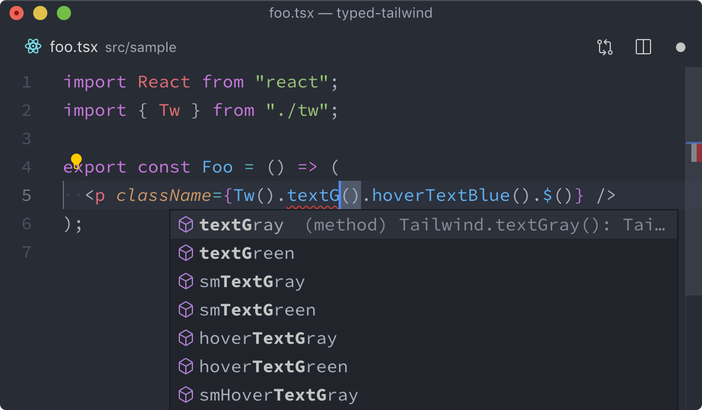

Recently I've been working on a fully strong-typed Typescript project (Prisma, Blitz.js, React) and it's been a bless.

The only non-typed part was styles: I'm using beloved https://tailwindcss.com/ and https://tailwindui.com/. Almost everything is great with it, there are many articles why it's awesome and won't dive into details here. Some people don't like it, but the majority thinks it's a great tool and I'm in the same camp with them.

## Problem

But one thing that started bothering me as the project grew. I was modifying the default `tailwind.config.js` to enable and disable some features and every time after the change I had to do full-text search to replace classes that we're modified or removed.

Writing components wasn't always easy too. I'm not Tailwind pro yet and I had to look up their documentation many times. This specific problem could be solved by using [their VSCode extension](https://marketplace.visualstudio.com/items?itemName=bradlc.vscode-tailwindcss) which provides quite advanced autocomplete, syntax-highlighting, and linting.

I wanted more. I wanted autocomplete no matter which editor you're using and I wanted type-safety so every mistake, typo, or using a class that is not generated anymore is caught during transpilation from Typescript to Javascript.

## Are there any existing solutions?

I did a quick research of the exising solutions. I was pretty sure that the problem is solved somehow. Yeah, it's solved but I didn't like the solutions.

https://github.com/thien-do/typed.tw is one of the solutions. It works quite good but Tailwind Plugins are not officially supported and PurgeCSS requires additional setup that might not work if you don't use Webpack.

<figure>
    
</figure>

I didn't like syntax and conditional application of classes seemed to complicated to me. I got used to https://github.com/JedWatson/classnames and wanted to use something close.

There were a couple of other less popupar solutions and they were either pinned to a specific Tailwind version and didn't allow using additional plugins, or required additional complicated setup in the toolchain.

So, I decided to come up with something that suits my needs.

## Solution

> Disclaimer. The solution doesn't claim to be universal, but it worked for me really well.
